## 平台介绍
无鱼工时管理系统，是一款轻量级工时记录和管理工具，包括项目管理，工时上报，工时日报，工时统计等功能。

无鱼工时管理系统可通过员工工时上报的方式，来记录项目所花费的工时，帮助企业进行项目工时统计、核算人工成本。实时、动态、真实的展示项目投入。

## 软件架构
JAVA 1.8 +  MYSQL 8 +VUE
本项目基于前后端分离架构：
服务端：springboot
前端：vue

| 模块  | 说明  |
|---|---|
| wuyu-common | 项目公共模块  |
| wuyu-system  | 系统功能的Module模块  |
| wuyu-framework  | 基础框架  |
| wuyu-admin-web  | 系统功能接口服务模块  |
| wuyu-prototype| 系统工时原型Module模块 |

## 源码说明：
本工程是后端代码，前端代码请看前端工程。

[前端工程源码]( https://gitee.com/wy-soft/wyproject-web)

[后端工程源码]( https://gitee.com/wy-soft/wyproject)

## 不推荐使用仓库最新代码进行生产使用。 master为最新的开发代码，会有不完整的功能，可能会无法正常使用。

## 功能列表
工时模块

1、我的工时：提交工时、查看详情、修改工时、我的工时、我的统计（填报率）。

2、项目统计：项目日报、项目月报、项目日历、项目工时详情。

3、项目投入：项目成本、项目投入进度、项目工时总计、工时明细、项目详情等。

4、工时统计：月统计、人员统计、填报详情。

5、工时审核：工时审批。

6、数据统计：填报率、上报记录、上报详情。

管理模块

1、项目管理：创建项目、添加人员、工时设置、状态管理、删除项目。

2、业务管理：加班管理、节假日管理、工作类型管理、工时审核管理。

3、成本管理：成本开关、岗位成本设置、人员成本设置。

4、组织管理：用户管理、角色管理、重置密码、批量删除。

5、职位管理：新增、修改、删除、批量删除等功能。

## 功能截图

#### 首页
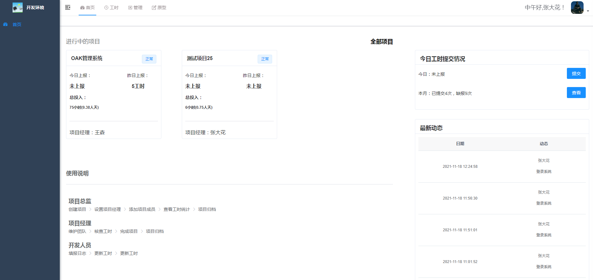

#### 我的工时

#### 提交工时

#### 我的项目

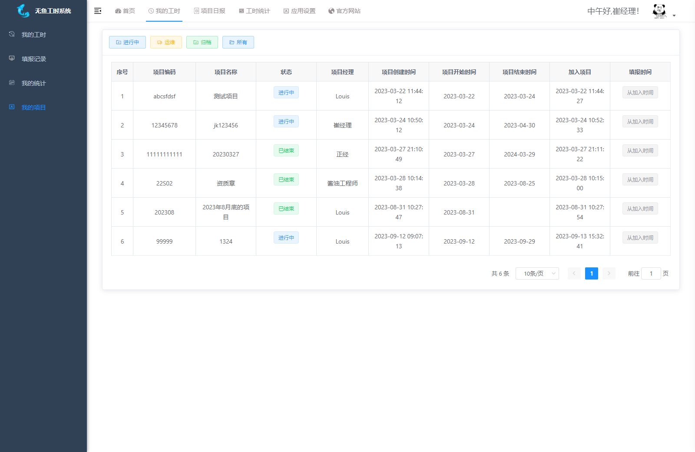

#### 我的工时统计
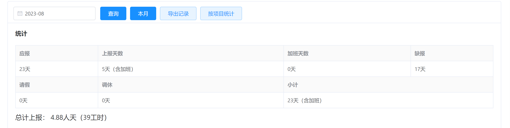

#### 我的填报率

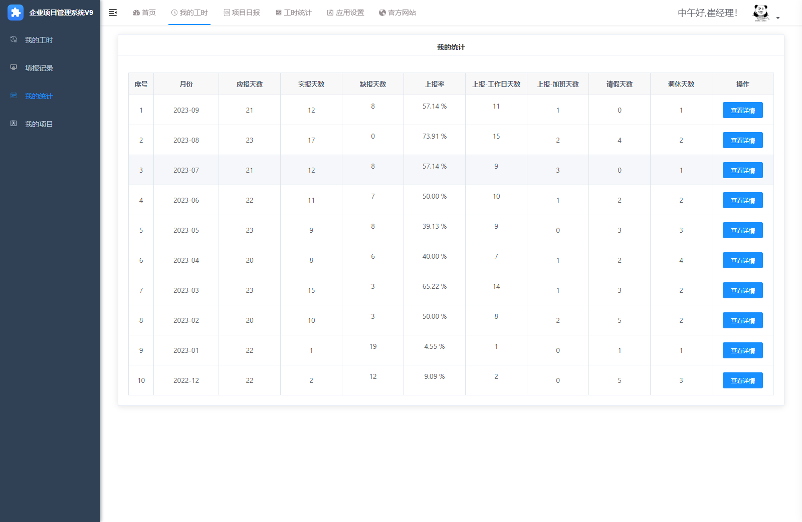

#### 我的填报日历
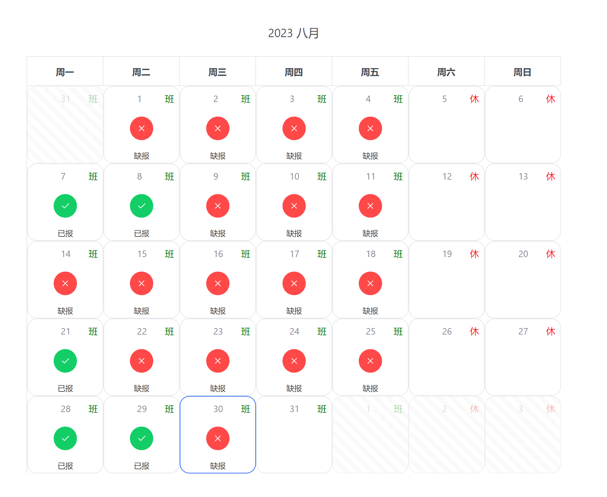

#### 我的工时列表
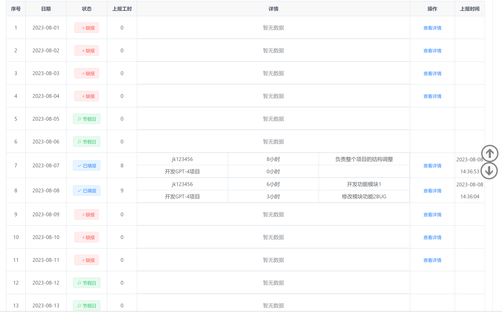

#### 项目日报
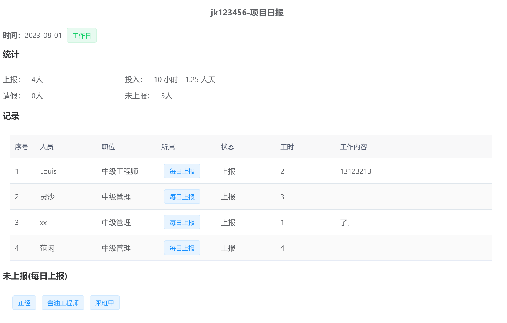

#### 项目月报
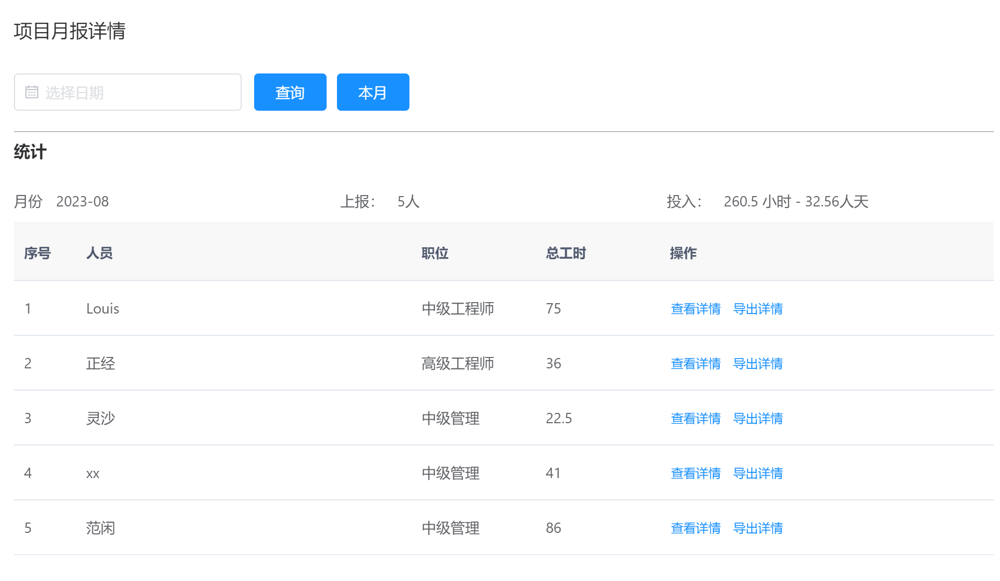

#### 项目月报记录
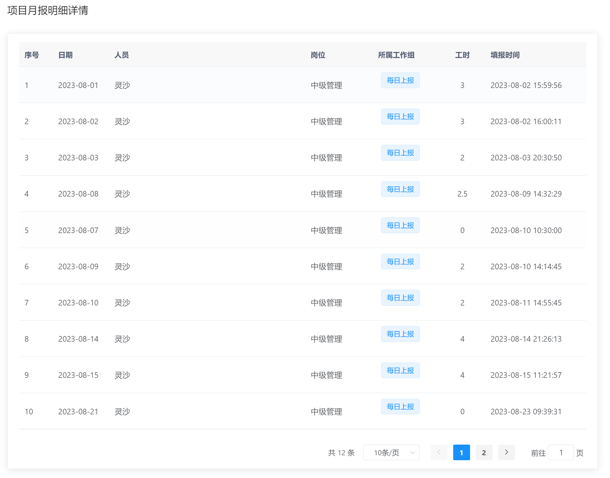

#### 项目日历
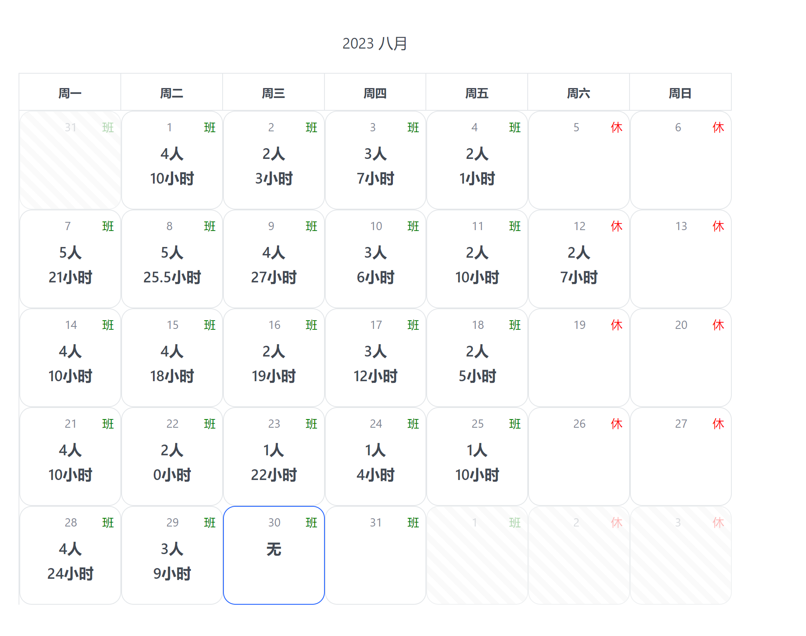

#### 填报记录

#### 工时审核

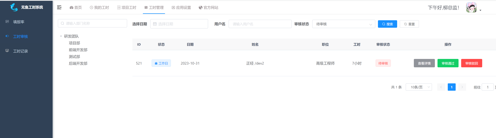

#### 项目统计
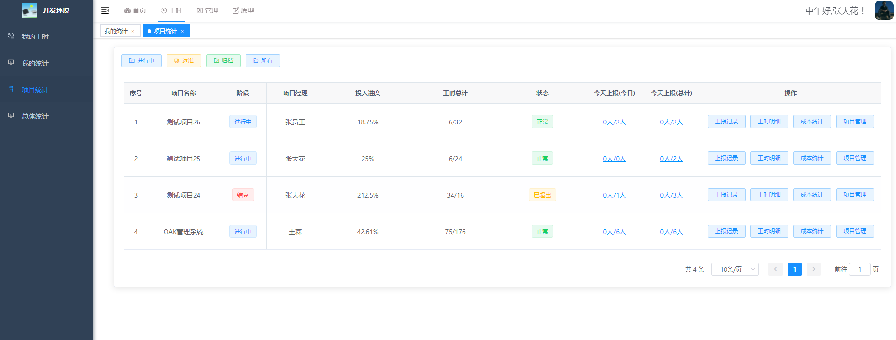

#### 数据统计

#### 填报率

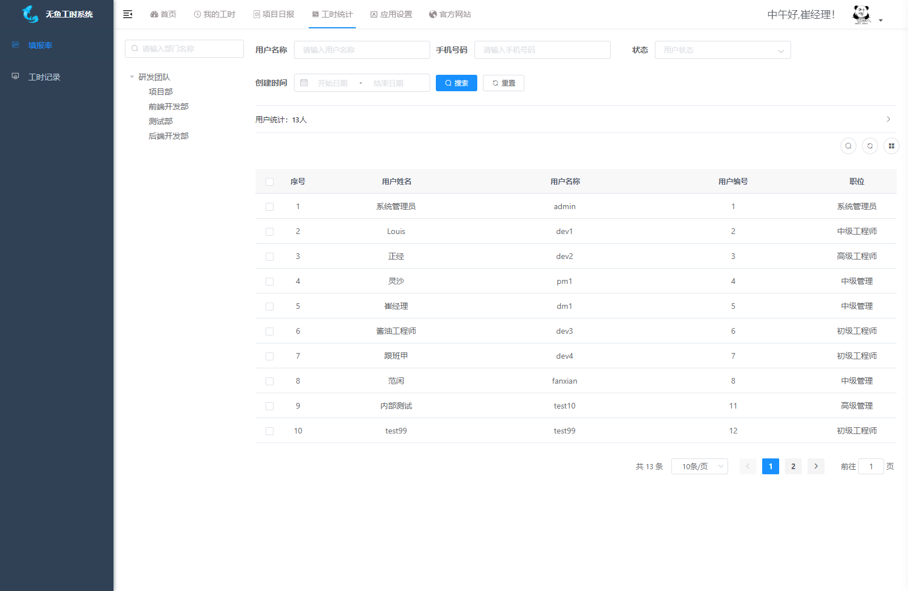

#### 项目填报详情
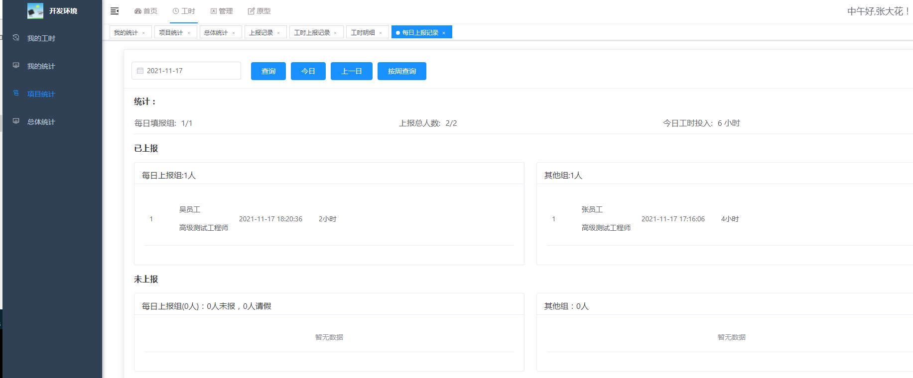

## 演示
~~http://demo.wuyusoft.com ~~

服务器到期，当前不可用。

| #| 角色 |	 账号 | 	密码    |  权限 |
| :--: | :------: | :------: |:------: | ---------- |
|演示环境账号1 |开发者 | 	dev1|	123456|填报工时|
|演示环境账号2 |开发者 |	dev2|	123456|填报工时|
|演示环境账号3 |项目经理 |	pm1  |	123456 |查看工时统计、管理项目人员|
|演示环境账号4 |项目经理 |	fanxian  |	123456 |查看工时统计、管理项目人员|
|演示环境账号5 |项目总监|	dm1	|123456| 查看工时统计、创建项目 |

自建环境没有以上账号，请搭建好系统后自行创建账号。

## 使用文档
~~[文档]( https://doc.wuyusoft.com/cost/)~~
服务器到期，当前不可用。

## 部署方式

~~[部署说明]( https://doc.wuyusoft.com/cost/install.html)~~

### 

默认管理账号：
admin
默认密码：
12345678

## faq

[相关问题]( https://doc.wuyusoft.com/cost/faq.html)

## 交流
1、QQ群用户群
加群请联系
QQ：307484308（1）

2、授权咨询
微信：Li1219324l（i）
括号去掉

3、网站
官网
http://www.wuyusoft.com

文档
~~ http://doc.wuyusoft.com/ ~~

## 其他项目
无鱼原型管理系统
https://gitee.com/wy-soft/mockup

## 感谢
该项目基于若依、vue、ele-admin-ui等相关框架，在此进行感谢。
