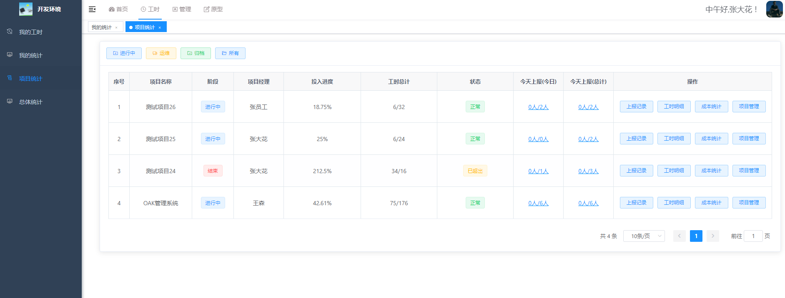

## 平台介绍
   无鱼工时系统（oak project），是一款轻量级工时记录和管理工具，目前包括项目管理，工时上报，工时日报，工时统计等功能。
   
   - 工时：工时统计可通过员工工时上报的方式，来记录项目所花费的工时，帮助企业进行项目工时统计、核算人工成本。实时、动态、真实的展示项目投入。

   

## 软件架构
JAVA 1.8 +  MYSQL 8 +VUE
本项目基于前后端分离架构，服务端：springboot ，前端采用vue。

[前端工程源码]( https://gitee.com/nineoak/wyproject-web)

[后端工程源码]( https://gitee.com/nineoak/wyproject)

## 功能列表
工时模块

1、我的工时：提交工时、查看详情、修改工时。

2、工时统计：统计详情、按月模式、填报详情。

3、项目统计：项目投入进度、项目工时总计、昨天上报、今日上报、上报记录、工时明细、项目详情等。

4、总体统计：人员上报记录、人员上报详情。

管理模块

1、项目管理：创建项目、添加人员、工时设置、状态管理、删除项目。

2、组织管理：用户管理、角色管理、重置密码、批量删除。

3、职位管理：包括筛选、新增、修改、删除、批量删除等功能。

4、成本管理：成本开关、岗位成本设置、人员成本设置。

## 功能截图

首页

我的工时

提交工时

填报记录

项目统计

数据统计

项目填报详情

原型分享

## 演示环境
http://test.hdfr.com.cn/
### 开发人员

用户名： cszh2
密码：123456

### 项目经理
具有项目统计功能

用户名： cszh1
密码：123456

### 项目总监
具有创建项目，工时日报，工时统计等功能

用户名： zongjian1
密码：123456

## 问题反馈
1、欢迎大家使用，项目开源免费，无特殊授权要求。

2、交流咨询请加QQ群
功能使用：336197563。

如对企业版感兴趣，请加入
企业测试交流群：4566602

## 安装步骤
1、一键部署，使用已经做好docker 镜像进行安装（推荐）。
镜像中已经安装好mysql、redis、nginx 以及nodejs环境，可直接简单修改即可完成进行前端编译，并完成部署。

查看安装说明： [安装说明](https://gitee.com/nineoak/oaker-project/wikis/%E9%83%A8%E7%BD%B2%E8%AF%B4%E6%98%8E/1.%E9%80%9A%E8%BF%87docker%E9%95%9C%E5%83%8F%E9%83%A8%E7%BD%B2?sort_id=5422808)

2、自定义部署
提供了自行部署mysql、redis、nginx等服务的方式，也可以使用原有的服务。需要自行进行前端代码编译。

查看安装说明： [安装说明](https://gitee.com/nineoak/oaker-project/wikis/%E9%83%A8%E7%BD%B2%E6%89%8B%E5%86%8C/%E9%83%A8%E7%BD%B2%E8%AF%B4%E6%98%8E)

## 感谢
该项目基于若依、ele-admin-ui等相关框架，在此进行感谢。
